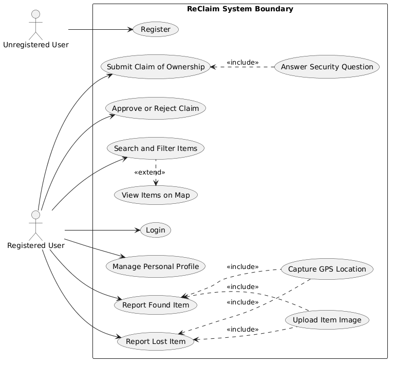
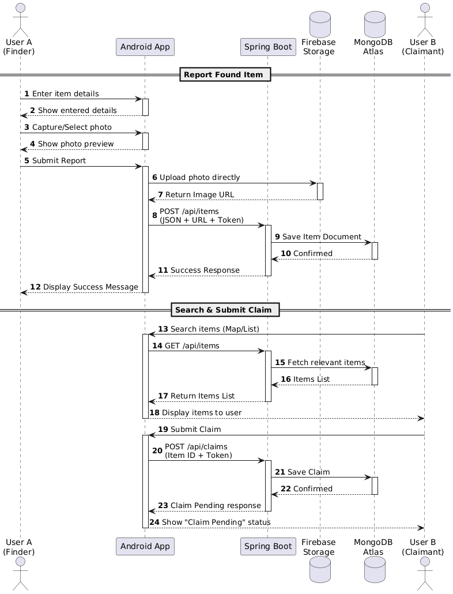
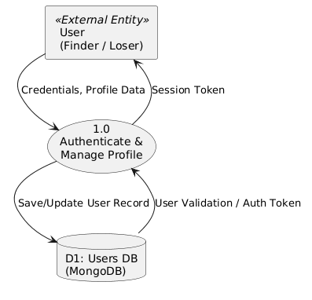
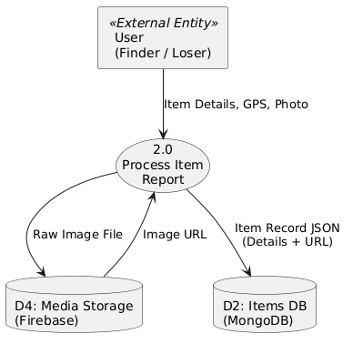
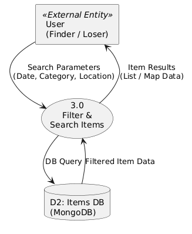
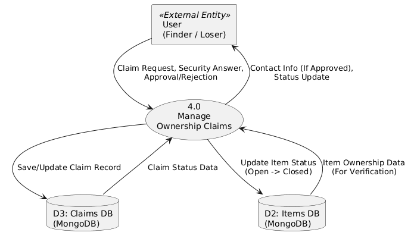

# ReClaim - Lost & Found Mobile Application

ReClaim is an advanced lost and found management system designed to connect item finders with owners through structured reporting, search, and validation processes.

---

## Table of Contents
1. [Project Overview](#project-overview)
2. [Background & Objectives](#background--objectives)
3. [Market Analysis & Limitations of Existing Solutions](#market-analysis--limitations-of-existing-solutions)
4. [System Architecture & Technology Stack](#system-architecture--technology-stack)
5. [System Modules](#system-modules)
6. [Core System Diagrams](#core-system-diagrams)
7. [Algorithmic Features & Analytics](#algorithmic-features--analytics)
8. [Security & Privacy](#security--privacy)

---

## 1. Project Overview
Losing personal items is a common problem, and owners frequently fail to recover valuable belongings due to a lack of centralized, organized platforms. **ReClaim** provides a seamless, secure, and structured platform to bridge the gap between finders and owners of lost property.

---

## 2. Background & Objectives
* **Target Audience:** Private individuals looking to report or find lost items, as well as public institutions/entities (schools, colleges, malls, public transit) wanting to manage found property efficiently.
* **Core Value Proposition:**
  * **Streamlined Discovery:** Fast search and filtering by category, location, and date, eliminating messy, unorganized social media posts.
  * **Structured Workflows:** Every item and ownership claim features clear tracking statuses (Open/Closed for items; Pending/Approved/Rejected for claims).
  * **Fraud Prevention & Permission Separation:** Only item posters can approve or reject ownership claims, preventing unauthorized access or false claims.
  * **Reliable Tracking:** Complete database logging of items, claims, and core operations for accountability and data recovery.

---

## 3. Market Analysis & Limitations of Existing Solutions
Existing solutions and their shortcomings compared to ReClaim include:
* **Foundtastic:** Features AI image analysis, but relies on web interfaces (with awkward mobile home-screen links) and features a cumbersome UI.
* **Chargerback:** Offers robust security against fraud, but targets businesses and enterprises rather than private individuals.
* **iLost:** A fast, free service, but lacks user registration and fails to save data for people actively searching for lost goods.
* **Traditional Physical Storage (Lost & Found desks):** Inefficient, requires physical presence, and items frequently "fall between the cracks" without accurate digital logging.

ReClaim improves upon these alternatives by offering a dedicated Android application, immediate cloud-backed database synchronization, robust role-based security, and a localized experience built for Israel.

---

## 4. System Architecture & Technology Stack
ReClaim utilizes an **n-tier (3-Tier) Client-Server Architecture** deployed on the cloud:
1. **Client Tier:** Native Android mobile application.
2. **Server Tier:** Spring Boot REST API application running continuously on **Render**.
3. **Database Tier:** Distributed NoSQL cloud database via **MongoDB Atlas**.
4. **File Storage Tier:** **Firebase Storage** dedicated to storing and serving image files efficiently.

### Technologies & Languages:
* **Backend:** Java 17+, Spring Boot, Spring Security, Spring Data MongoDB, JJWT (JSON Web Tokens), Lombok, Maven.
* **Frontend (Client):** Android SDK (Java/XML), Google Maps SDK, Google Location Services, Google Geocoding API, Retrofit, Glide.
* **Database & Storage:** MongoDB Atlas, Firebase Storage.
* **Version Control:** Git & GitHub.

---

## 5. System Modules
* **User Management Module:** Handles user registration, secure authentication, validation, and session management using JWT tokens.
* **Items Management Module:** Manages the logic for publishing found/lost items, categorizing them, and executing multi-parameter searches.
* **Claims Module:** Oversees ownership requests, status changes (Pending/Approved/Rejected), and secures contact details until claims are formally approved.
* **Storage Module:** Handles client-side image compression and uploads directly to Firebase Storage, storing only image URLs inside MongoDB.

---

## 6. Core System Diagrams

### Use Case Diagram (Users & Actions)

### Sequence Diagram (Business Logic Call Flow)

### Data Flow Diagram

---

## 7. Algorithmic Features & Analytics
* **Multi-Dimensional Querying & Indexing:** Combines text search with strict categorical, temporal, and spatial filters. MongoDB B-Tree indexes back these queries to ensure minimal search latency without full collection scans.
* **Statistical Insights & Analytics:** 
  * *Success Rate Calculation:* Tracks open vs. closed item statuses to measure platform utility.
  * *Hotspot Identification:* Uses geographic coordinates converted via Google Geocoding API to pinpoint high-loss public locations.

---

## 8. Security & Privacy
* **Client-Side Security:** Sensitive information (such as raw passwords) is restricted to transient RAM variables and immediately wiped after submission. JWT tokens are securely saved locally.
* **Network Security:** All traffic between the Android application, Spring Boot server, MongoDB Atlas, and Firebase uses encrypted **HTTPS/TLS** connections.
* **Server-Side Authorization (Spring Security):** Enforces strict access control rules, ensuring users can only edit or manage items/claims they own.
* **Database Protection:** Passwords are never stored in plain text; they undergo secure one-way **Hashing**. MongoDB Atlas is restricted via network IP whitelisting.
* **Anti-Fraud Mechanism:** Finder contact details are hidden during general browsing. Claimants must correctly answer a hidden validation question defined by the finder, and claims require explicit manual approval by the item poster before communication channels open.